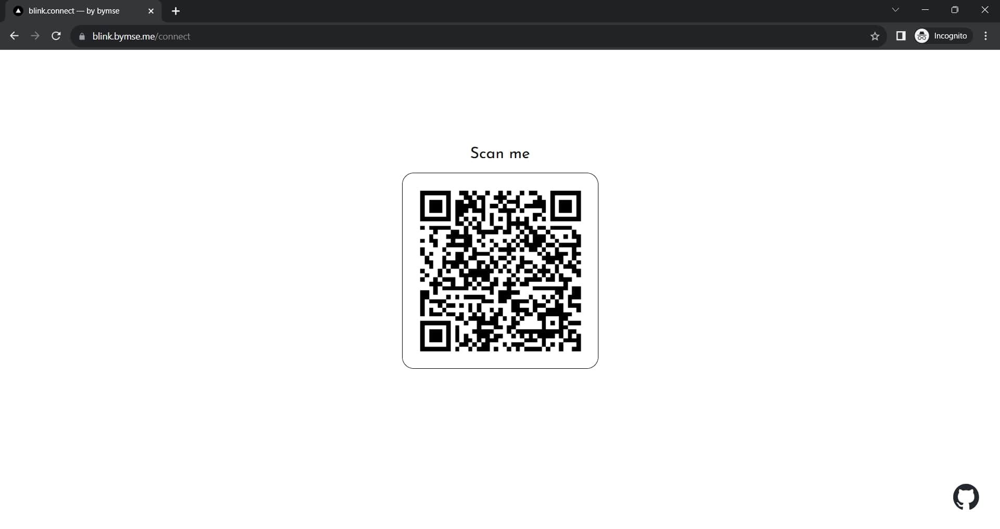
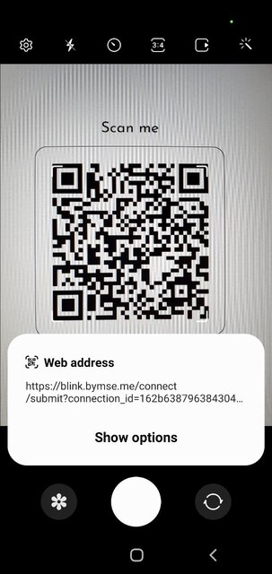
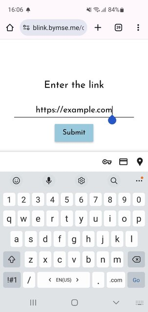
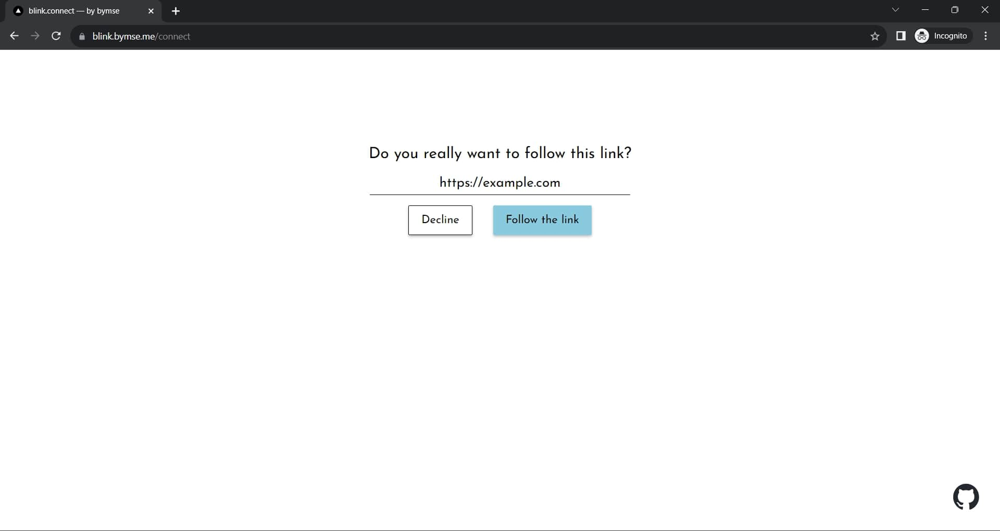
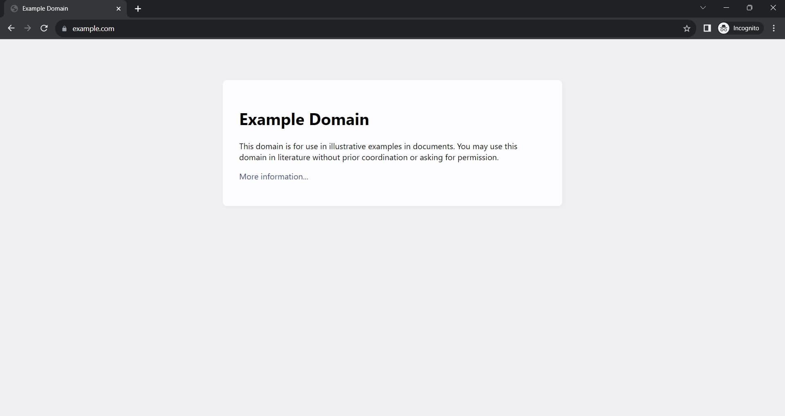

# blink.connect

https://c.bymse.me

**blink.connect** is a simple web tool that enables you to effortlessly open URLs from one device on another.

## Why do I need it?

Here's an example to illustrate: imagine needing to access an online document on an unfamiliar device. You could either type the URL manually or send it to yourself via email or messenger. However, sending it as a message might require logging in to your account on the unfamiliar device, making the process cumbersome and potentially risky.

Enter **c.bymse.me**. Simply scan the QR code on the target device and input the URL from your phone. That's it!

## How to use it?

**Step 1:** Open [https://c.bymse.me](https://c.bymse.me) in the browser on the target device (the device where you want to open the URL).

**Step 2:** Scan the QR code with your phone (the device from which you want to open a URL) and open the link.

**Step 3:** Paste the URL you want to open on the target device and click "Submit."

**Step 4:** Confirm the URL on the target device.

**Step 5:** The URL should now open on the target device.

